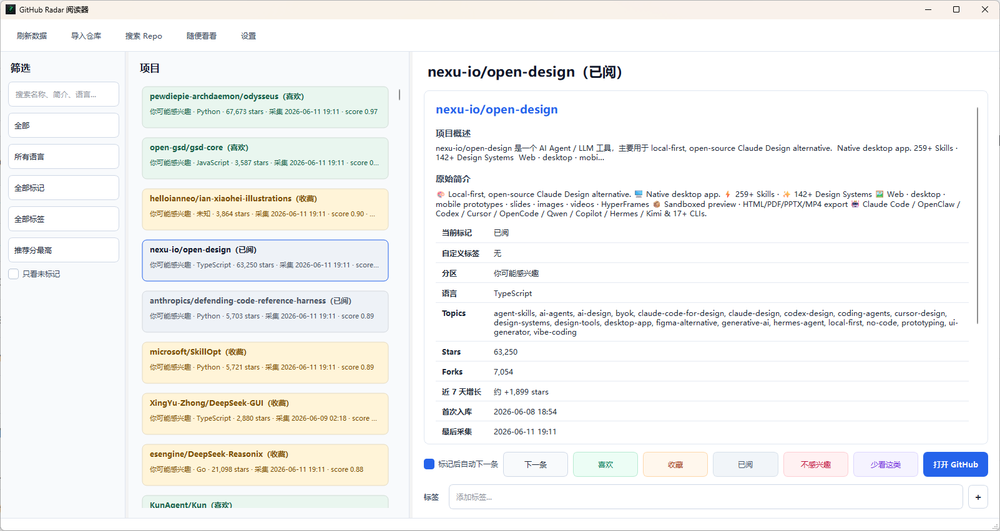

# GitHub Radar

<p align="center">
  
</p>

GitHub Radar 是一个本地优先的 GitHub 热门项目雷达。它会采集热门仓库，按热度、增长、新鲜度和你的反馈排序，并提供桌面阅读器来筛选、标记、加标签和导入项目。

GitHub Radar is a local-first radar for trending GitHub repositories. It collects popular repos, ranks them by heat, growth, freshness, and your feedback, and provides a desktop reader for filtering, marking, tagging, and importing projects.

这是 vortexer99 的个人项目，主要按个人使用需求演进。不承诺长期维护、功能支持或兼容性保证。有功能需求可以发 issue。

This is a personal project by vortexer99 and evolves mainly around personal usage needs. No long-term maintenance, support, or compatibility guarantee is promised. Feature requests can be filed as issues.

当前版本 / Current version: `1.0.5`

变更日志 / Changelog: [CHANGELOG.md](CHANGELOG.md)

## 快速开始 / Quick Start

日常使用建议直接运行桌面版：

For daily use, run the desktop app:

```text
GitHubRadarReader.exe
```

第一次运行会在应用所在目录创建 `radar.toml`，并按需创建 `data\radar.db`、`reports\` 和数据库表。报告会写入 `reports\`，本地数据默认保存在 `data\radar.db`。

On first run, the app creates `radar.toml` next to the app and creates `data\radar.db`, `reports\`, and database tables as needed. Reports are written to `reports\`, and local data is stored in `data\radar.db` by default.

推荐先打开“设置”配置 GitHub Token；也可以先不配置，应用会按认证优先级自动降级。

Open "设置" / "Settings" first if you want to configure a GitHub Token. You can also leave it empty; the app falls back through its credential priority automatically.

## GitHub 认证 / GitHub Auth

建议配置 GitHub Token，提高 API 额度。

A GitHub Token is recommended for higher API rate limits.

认证优先级 / Credential priority:

1. 设置页保存的 GitHub Token / GitHub Token saved in Settings
2. `gh auth token`
3. `GH_TOKEN` / `GITHUB_TOKEN`
4. 匿名 GitHub API / Anonymous GitHub API

Token 会保存到应用目录的 `.env` 文件，`.env` 已加入 `.gitignore`。不要把真实 Token、`.env`、本机绝对路径或私人数据写入 README、配置示例或提交记录。

The token is saved to the app folder's `.env` file, which is ignored by Git. Do not put real tokens, `.env` files, local absolute paths, or private data in README examples, configuration examples, or commits.

环境变量示例：

Environment variable example:

```powershell
$env:GITHUB_TOKEN = "<your-github-token>"
```

## 桌面阅读器 / Desktop Reader

<p align="center">
  
</p>

主要工作流：

Main workflow:

1. 左栏筛选：搜索、分区、语言、反馈状态、标签、排序。
   Use the left column for search, section, language, feedback status, tag, and sorting filters.
2. 中栏浏览仓库列表；已反馈项目会显示不同底色。
   Browse repositories in the middle column; feedback-marked repos use different background colors.
3. 右栏阅读详情、打开 GitHub、记录反馈、管理自定义标签。
   Read details, open GitHub, record feedback, and manage custom tags in the right column.
4. 点“刷新数据”默认只重新加载本地数据库；勾选“从 GitHub 获取最新数据后再刷新”才会采集远端数据。
   Click "刷新数据" / "Refresh data" to reload local data by default; select "从 GitHub 获取最新数据后再刷新" to fetch from GitHub first.
5. 用“导入仓库”批量导入指定仓库。
   Use "导入仓库" / "Import repositories" to batch import specific repos.
6. 用“搜索 Repo”按 topic 或关键词搜索并勾选导入。
   Use "搜索 Repo" / "Search Repo" to search by topic or keyword and import selected repos.
7. 用“设置”配置 GitHub Token、查看认证优先级和软件信息。
   Use "设置" / "Settings" to configure the GitHub Token, view credential priority, and see app information.

反馈按钮支持切换状态：对未标记仓库点击会设置标记；对已有相同标记的仓库再次点击，会取消该标记。

Feedback buttons are toggles: clicking a feedback action marks an unmarked repo, and clicking the same action again clears that mark.

标签栏支持输入新标签，也支持从已用过的标签中补全选择。批量导入可以给本批仓库统一加标签，topic 搜索导入会自动把搜索词作为标签。

The tag bar supports typing new tags and completing from existing tags. Batch imports can apply shared tags, and topic search imports automatically tag repositories with the search term.

## 自动运行 / Scheduled Runs

如果下载的应用文件夹里包含 `run-radar.ps1`，可以用 Windows 计划任务定时抓取。请先把文件解压到固定目录，例如：

If the downloaded app folder includes `run-radar.ps1`, you can use Windows Task Scheduler for scheduled collection. First extract the files to a stable directory, for example:

```text
C:\Tools\GitHubRadar\
  GitHubRadarReader.exe
  run-radar.ps1
  README.md
```

在 PowerShell 中运行下面一行命令，创建每周一、周四 06:00 自动抓取的计划任务：

Run this one-liner in PowerShell to create a scheduled task that collects data every Monday and Thursday at 06:00:

```powershell
schtasks /Create /TN "GitHub Radar" /SC WEEKLY /D MON,THU /ST 06:00 /TR 'powershell.exe -NoProfile -ExecutionPolicy Bypass -File "C:\Tools\GitHubRadar\run-radar.ps1" -AssumeYes' /F
```

`run-radar.ps1` 会优先调用同目录里的 `GitHubRadarReader.exe --run --config radar.toml --log run-radar.log`；找不到 exe 时才回退到源码模式。抓取日志会写入 `run-radar.log`。如果 GitHub API 返回错误，脚本会显示日志最后几行。

`run-radar.ps1` prefers `GitHubRadarReader.exe --run --config radar.toml --log run-radar.log` from the same directory and falls back to source mode only when no exe is found. Collection logs are written to `run-radar.log`; when GitHub API errors occur, the script prints the last log lines.

如果不是 Windows，或者不想使用 Windows 计划任务，请用系统自带的定时器，例如 cron、systemd timer 或其他任务调度工具。

On non-Windows systems, or if you do not want to use Windows Task Scheduler, use your system scheduler such as cron, systemd timers, or another task runner.

## 源码模式 / Source Mode

如果你从源码运行：

If you run from source:

```powershell
python -m pip install -e .
python -m github_radar.reader_app
```

源码模式也可以使用命令行：

Source mode also provides CLI commands:

```powershell
python -m github_radar collect --dry-run
python -m github_radar collect
python -m github_radar report
python -m github_radar run --config radar.toml
python -m github_radar import-repo owner/repo another/repo
```

源码目录下可以用内置脚本注册 Windows 计划任务，默认周一和周四 06:00 运行：

In a source checkout, you can register a Windows scheduled task with the helper script. It runs on Monday and Thursday at 06:00 by default:

```powershell
.\scripts\install-windows-task.ps1
```

改时间：

Use a different time:

```powershell
.\scripts\install-windows-task.ps1 -Time "18:30"
```

## 配置 / Configuration

主要配置在 `radar.toml`。

Main configuration lives in `radar.toml`.

- `db_path`：SQLite 数据库路径 / SQLite database path
- `report_dir`：报告输出目录 / Report output directory
- `min_stars`：采集查询的最低 stars / Minimum stars for collection queries
- `per_page`：每个 GitHub 查询拉取数量 / Number of results per GitHub query
- `created_within_days`：新建仓库查询窗口 / Creation-date query window
- `pushed_within_days`：近期更新仓库查询窗口 / Recent-push query window
- `exploration_ratio`：探索推荐比例 / Exploration recommendation ratio
- `languages`：限定语言 / Language filters
- `excluded_terms`：降权关键词 / Downranked keywords
- `query_templates`：GitHub 搜索模板 / GitHub search templates
